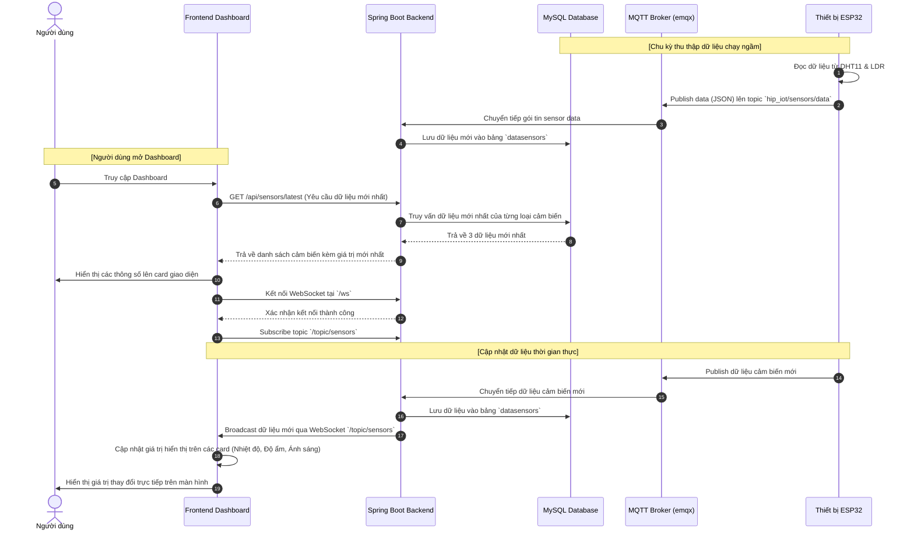
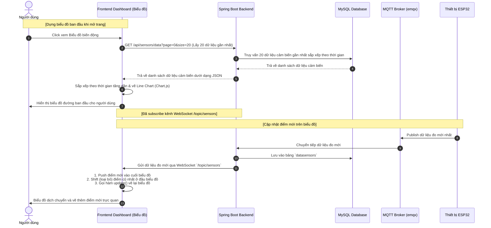
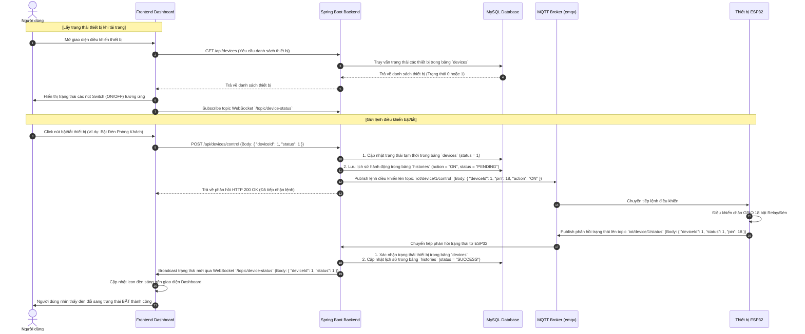
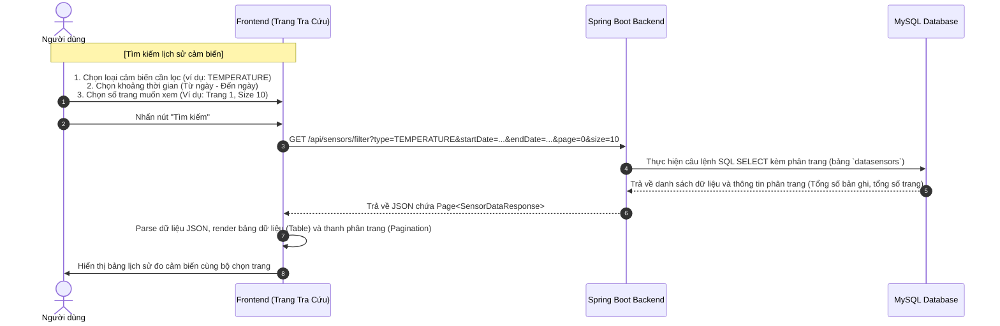
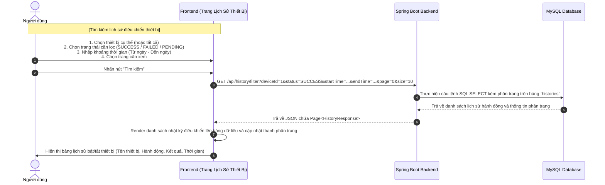

# Biểu đồ Sequence Diagram (Mermaid) cho 5 Use Case

Dưới đây là mã nguồn Mermaid chi tiết cho 5 Use Case của hệ thống SmartHome IoT. Bạn có thể sao chép phần mã trong các khối code và dán vào [Mermaid Live Editor](https://mermaid.live/) hoặc các công cụ hỗ trợ markdown để xem hình ảnh trực quan.

---

## 1. UC1: Hiển thị thông số nhiệt độ, độ ẩm và ánh sáng

---

## 2. UC2: Hiển thị biểu đồ biến động dữ liệu cảm biến thời gian thực

---

## 3. UC3: Giám sát trạng thái và điều khiển bật/tắt thiết bị

---

## 4. UC4: Tra cứu lịch sử dữ liệu cảm biến

---

## 5. UC5: Tra cứu lịch sử bật/tắt thiết bị

